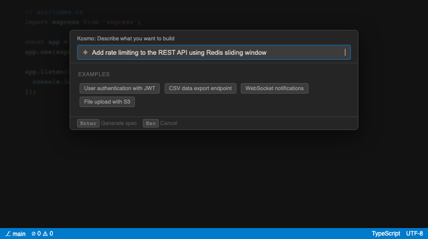
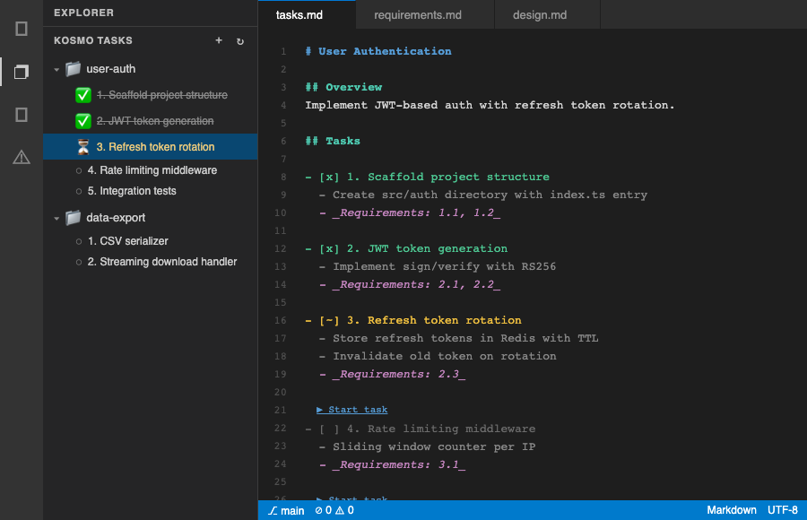
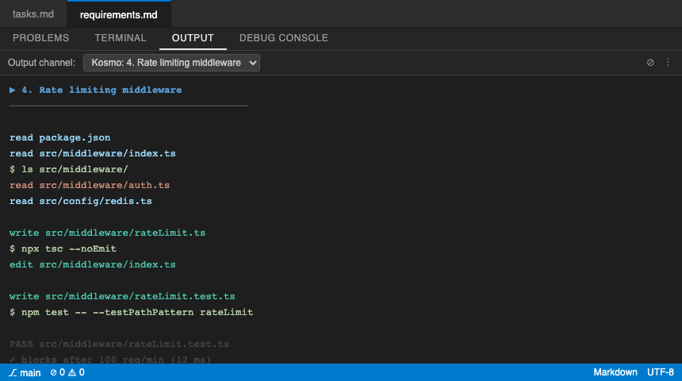

# Kosmo Sidekick

Spec-driven development for VSCode — powered by Claude Code CLI. Describe a feature, get a full requirements + design + task breakdown, then run each task as an isolated AI agent.

Inspired by [Kiro](https://kiro.dev/).

---

## How it works

1. **Describe** what you want to build
2. **Kosmo generates** `requirements.md` → `design.md` → `tasks.md` for your feature
3. **Run tasks** — each one spawns a Claude Code agent with injected spec context
4. **Track progress** in the sidebar and directly in `tasks.md`

---

## Screenshots

### New Spec — describe your goal



### Sidebar — tasks grouped by spec, with live status



### Output — live agent tool-use stream with cost



---

## Requirements

- VSCode 1.75+
- [Claude Code CLI](https://claude.ai/code) installed and authenticated (`claude` on PATH)

---

## Installation

1. Clone this repo
2. `npm install && npm run compile`
3. Press **F5** to launch the Extension Development Host

Or install the `.vsix`:

```bash
npm run package
code --install-extension kosmo-sidekick-*.vsix
```

---

## Usage

### Generate a spec

Open the Command Palette (`⌘⇧P`) → **Kosmo: New Spec**

Enter a goal like:
> _"Add rate limiting to the REST API using a Redis sliding window"_

Kosmo writes three files to `.kosmo/specs/[spec-name]/`:

| File | Contents |
|---|---|
| `requirements.md` | User stories + EARS acceptance criteria |
| `design.md` | Architecture, components, data models |
| `tasks.md` | Numbered checkbox task list |

### Run a task

Click **▶** next to any `[ ]` task in the sidebar or in `tasks.md` via CodeLens.

A Claude Code subprocess runs the task in your workspace CWD with the full spec as context. The Output Channel streams every tool call in real time. When done, the checkbox updates to `[x]` automatically.

### Kill a running task

Click **⏹** next to any `[~]` task. The marker reverts to `[ ]`.

---

## Spec file format

`tasks.md` uses a strict format that Kosmo parses:

```markdown
- [ ] 1. Task title
  - implementation detail
  - another detail
  - _Requirements: 1.1, 2.3_
```

States: `[ ]` pending · `[~]` in progress · `[x]` done

---

## Project context

For best results, fill in the generated `CLAUDE.md` at your project root. Every agent subprocess receives it as context alongside the spec files.

```markdown
# Project Context
## Tech Stack
## Architecture Notes
## Coding Conventions
```

---

## Extension commands

| Command | Description |
|---|---|
| `Kosmo: New Spec` | Generate spec from a goal string |
| `Kosmo: Start Task` | Run selected task via Claude Code |
| `Kosmo: Kill Task` | Stop running task |
| `Kosmo: Refresh Tasks` | Manually refresh sidebar |
